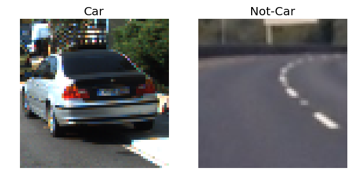
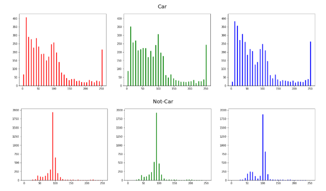
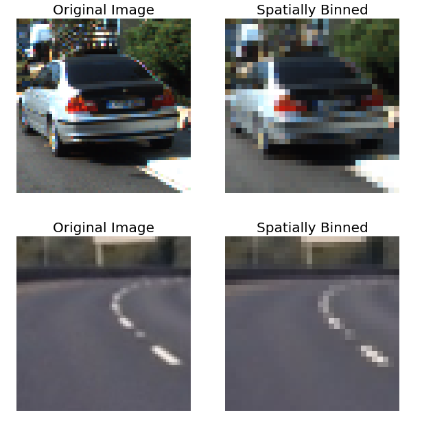
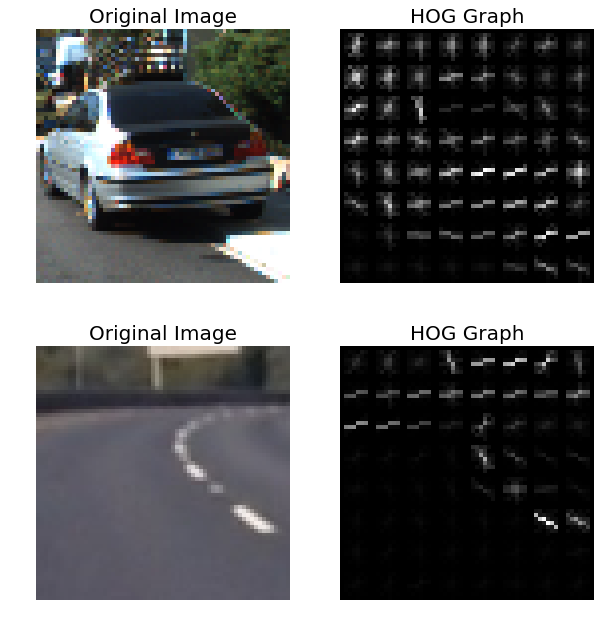
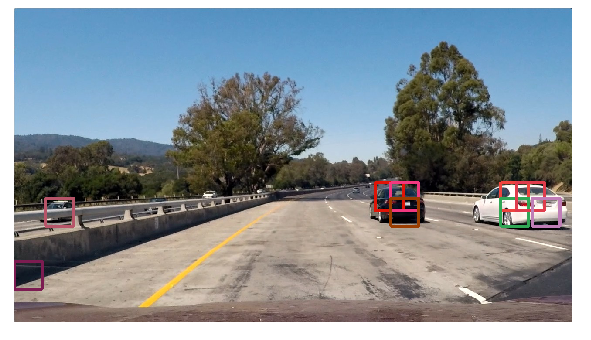
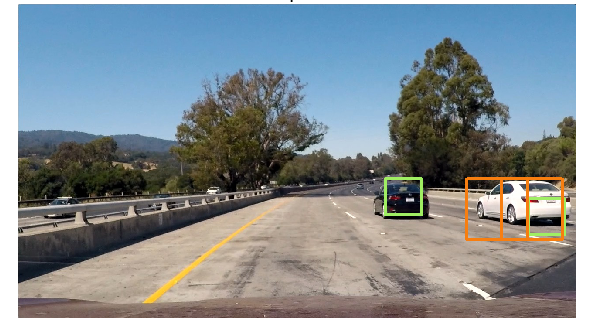
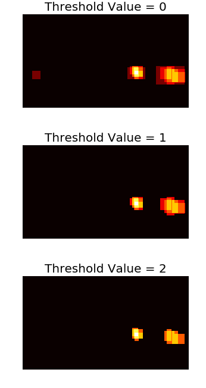
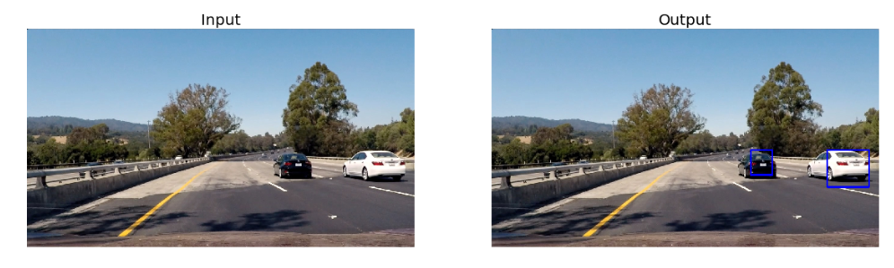

# Vehicle Detection
##### James Korge
-------------------------------------------------------------------------------------------
The aim of this project was to develop a pipeline capable of identifying vehicles in an image and applying this pipeline to the frames of a video recorded from a car’s dash cam as it drove down a highway. Such feats are only achievable with machine learning tools such as the Linear Support Vector Machine (SVM) used in this project. Along with a robust preprocessing framework, it is possible to develop a program which achieves the desired goal of tracking vehicles in a recorded video.

## Preprocessing
The preprocessing of data in this project consisted of gathering a set of three key features:
1. A histogram of the pixel distribution of colors in each image
2. A spatially binned array of pixels for each image
3. A Histogram of Oriented Gradients (HOG)
These features were extracted from a set of ~16000 vehicle and non-vehicle images.

<div style="text-align:center"></div>
<div style="text-align:center">Figure 1 Sample of images from the dataset </div>

### Color Histogram
The first set of features to be extracted from any data is a set of histograms indicating the number of pixels in each of a predetermined number of bins in each color channel. In the figure below it is easy to see that the non-vehicle image contains sharp peaks around a value of 100 for each channel while the vehicle image has a broader range of values for each color.

<div style="text-align:center"></div>
<div style="text-align:center">Figure 2 Color histograms for a pair of sample images</div>

These values were unraveled and concatenated for the first block of each image’s feature vector.

### Spatial Binning
The second set of feature data to be extracted was the spatially binned pixel values. These were obtained with a call to cv2’s resize function which scaled the images down to some set dimensions in x and y:

<div style="text-align:center"></div>
<div style="text-align:center">Figure 3 Sample images before and after spatial binning</div>

This aggregates the information in a small region of pixels into a single one. Although the image is more pixelated, it has a denser description of the shape of the object therein. This reduces both the time to train a classifier and the chance of overfitting data.

### HOG Data
The last feature data to be extracted was a Histogram of Oriented Gradients (HOG). This feature, like spatial binning, aggregates the data over a region of the image. By scanning through the image in blocks, the result of skimage’s hog is a graph of edge gradients aggregated into a histogram over each block. This feature has the advantage of indicating both shape and color. When combined with color histograms and spatial bins, the resulting feature set is robust enough to begin training.

<div style="text-align:center"></div>
<div style="text-align:center">Figure 4 Sample images and their corresponding HOG data. The HOG was calculated on a randomly chosen color channel from the BGR format in which the images were read</div>

## Feature Extraction & Model Training
The process of gathering the features consisted of defining a function (extract_features) which took in all the parameters relating to computing the features, including a set of Boolean variables indicating which features should be taken.
Once the features were extracted they were assembled into appropriate shaped numpy arrays, correlated to a set of labels (1 for cars, 0 for not), split into training and test sets, and passed into a Linear SVM for fitting. The SVM in question was a sklearn’s LinearSVC with default settings. Once fit, the classifier was used to return an measure of accuracy against the validation set.
It was noticed early on, that the effect of varying the HOG parameters had a greater impact on the validation accuracy than did the spatial and color features. As such, to save time the latter features were removed from consideration while the classifier was trained on several dozen different HOG parameters . Once the optimal HOG parameters were chosen, the spatial and color features were used to train the classifier as well. The final feature extraction parameters were:

```python
colorspace = 'YUV'  
 
hog_feat = True  
orient = 15  
pix_per_cell = 18  
cell_per_block = 2  
hog_channel = 'ALL'  

spatial_feat = True  
spatial_size = (32, 32)  
 
hist_feat = True  
hist_bins = 32  
hist_range=(0, 256)
```

## Image Scanning

<div style="text-align:center"></div>
<div style="text-align:center">Figure 5 Output of a windowing function. The vehicles in the image have been identified by several windows. Only a single set of start/stop/scale parameters were used to obtain this result</div>

To identify regions of the image which contained vehicles, a windowing function was employed to scan the image and pass features from each window into the classifier for analysis. The steps the window took were passed on those used by to compute the HOG features and could be modulated by a small scaling factor. The scaling factor allows for smaller or larger regions of the image to be dully enlarged or shrunk so as to collect appropriately sized feature sets for classification. Having access to different sized regions allows for the identification of vehicles at various distances. By cycling through this process with several different start/stop conditions and scale factors, an exhaustive scan can be enacted. Once a window has been identified as containing a car, it is passed onto a list, returned from the function, for further analysis. 
 
<div style="text-align:center"></div>
<div style="text-align:center">Figure 6 Output of windowing function after application with several different start/stop/scale parameters</div>

## False Positives
In some of the test images, false positives were noted to have occurred. To reduce the incidence of these a heatmap was calculated of the results from images like those in Figures 5 and 6. The heatmapping consists of adding one to a pixel value on a blank image every time it is flagged in the windowing process as belonging to a vehicle. By only considering a minimum threshold for these values, the false positive regions (which tend to have fewer windows) can be filtered out.
Once the false positives are filtered out, scipy’s label function can cluster the disparate windows into a single contiguous region. The outermost pixels of this region are used to define a rectangle which is finally drawn on the image to identify the vehicle.

<div style="text-align:center"></div>
<div style="text-align:center">Figure 7 Heatmap for the image in Figure 6 with false positives filtered out at low threshold value</div>

## Video Analysis
The [final video](https://youtu.be/xV3nZ1AxM0E) shows that the pipeline is now capable of tracking vehicles through a video. Although some false positives emerge in a few frames, they are quickly removed thanks to the moving average of the heatmaps collected in a log deque. The other issue is that despite scanning the image over many different regions and scale factors, the classifier is unable to detect the white vehicle in the video after a distance which, in practice, may be too close to go undetected. However, the vehicle is kept under detection with consistency and is distinctly detectable from other vehicles in the image. The final result even managed to detect the last vehicle to the enter the frame from the right. Despite this vehicle only being present for a fraction of a second, the pipeline classified it as positive over so many windows as to return a unique label even after averaging the heatmap over several frames.

<div style="text-align:center"></div>
<div style="text-align:center">Figure 8 Image before and after processing pipeline. The vehicles are successfully marked and no false positives are present.</div>

In the original submission for this project, there was a serious issue with false positives. In seeking a solution for this, the entire pipeline was replaced with a much simpler one . In so doing it was discovered that the original pipeline only recorded the bounding boxes of positive detections after the final scan of the image was completed. Consequently, the heatmap did not have enough information for accurate labels to be derived. Once this was corrected (and the scanning ranges adjusted) the pipeline was able to successfully track vehicles through the video.
Further development will be necessary to completely remove all false positives and ensure tracking of the vehicles over longer distances. Such developments would investigate improving classification accuracy with different feature extraction parameters, implement hard-negative mining to provide a more robust dataset to the classifier, and scan the image over a more effective range of scales and pixel boundaries.
