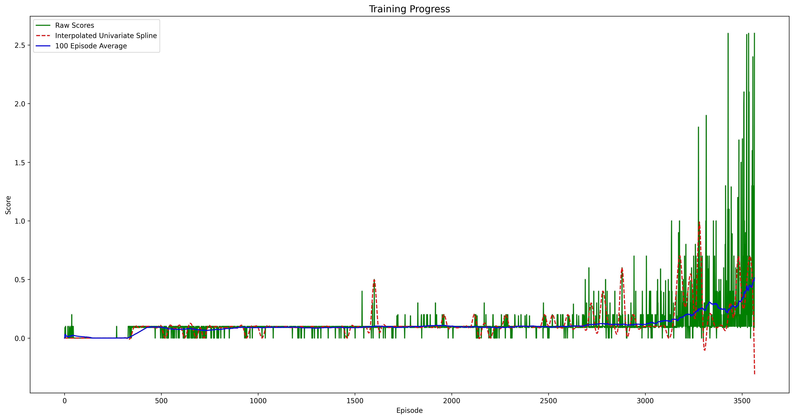

# Project 3 - Collaboration & Competition

This repo contains a submission for the third project of Udacity's Deep Reinforcement Learning Nanodegree. This submission implements a joint Distributional Agent as a means to controlling both players and solving the provided Tennis environment.

## Requirements

The task at had is to keep a ball in the air by controlling both players in a game of "tennis". The players receive a reward of +0.1 every time they hit the ball over the net; a reward of -0.01 every time the ball hits the floor, goes out of bounds, or hits the net. In each episode the score is determined by the highest score of both agents. The agents are deemed to have solved the environment when they acheive an average score of +0.5 over the last 100 episodes.

## Methods

### Distributional Deep Deterministic Policy Gradients

At the heart of this program is a Reinforcement Learning (RL) agent designed to control the arm and learn from its experience using an Actor-Critic framework implementing Distributional Deep Deterministic Policy Gradients. 

The actor component is a neural network which produces a prediction of the optimal action the agent should take at each timestep - an approximation of the optimal policy π\*. The critic, another neural network, predicts a distribution of state-action values - an approximation of the distribution over the range of the Q-value function. In this implementation the distribution is a categorical distribution over a predefined support. Each value of the distribution represents the probability that the action, provided by the actor network, will result in that value. For this implementation the support is defined over the range `[-0.01, 0.5]` corresponding to the highest and lowest rewards an agent can receive over a 5-step trajectory. The number of bins within the support is set to 100.

#### Updates

As in the first project, the models are updated in a manner befitting deep Q-learning. Two instances of each network are instantiated - a local and a target network. The former network predicts what actions the agent should take and their corresponding values; the latter, the target values against which the local model will be compared.

At each timestep the local models are provided four minibatches of data and update their parameters after computing the loss of each batch. Then, the target networks are updated with an exact copy of the local networks' parameters. Soft updates were tested but did not demonstrate improvements to the networks' performance.

### Experience Replay

In the simplest case Q-Learning will have the agent update its network parameters at every timestep. However, consecutive actions may be strongly correlated and can impair the network's learning process when these updates are applied consecutively. To mediate this instability Deep Q-Learning will have the agent collect tuples of state-action-reward transitions and sample these randomly to generate a minibatch of data for updating the neural network.  
In this implementation, the 20-agent environment formed the basis for all development. In this context, experiences are futher decoupled by the fact that the networks are updated from experiences sampled randomly from a buffer to which multiple agents contribute.

#### N-Step Bootstrapping

Somewhere between Monte-Carlo learning and TD-Learning lies N-Step Bootstrapping. In this variation, rather than learning from an entire episode of experience (as in Monte-Carlo) or from a single timestep of experience (as in TD learning) the agent learns after some intermediate value of timesteps. In this implementation the default value of 5-step trajectories were stored to the replay buffer. The saved data from the trajectories comprised the state of the agent at the start of the trajectory, the action the agent took from that state, the total discounted return of the entire trajectory, the state of the agent at the end of the trajectory, and a boolean flag indicating whether the agent arrived at a terminal state. The advantage here is to balance uncertainty with timely convergence.

#### Prioritization

Not all experience is equal. Trajectories which yield a larger error are more valuable to the learning process. To take advantage of this, the replay buffer maintains a record of each trajectories priority which can be used to preferentially select those trajectories. This priority is, in practice, the TD error of the critic model's prediction. These priorities, after normalization, define a probablitity of drawing each corresponding unit of experience for the next minibatch of training data. Accounting for this requires modifying the updates to the critic model by a value inversely proportional to the size of the replay buffer and the priorities of each record therein:  
^\beta)

### Multi-Agent Control

#### Joint Agent (JA)

In the JA implementation, a single actor network and a single critic network are trained on experiece from a shared buffer. This is a reasonable approach in this environment as the agents have the same objective: keep the ball in the air. Additionally, each player's observations are made from their own reference frame. As such, the positions and momenta observed by one player are indisiguishable from the same observations made by the other player making their individual experiences mutually beneficial.  
At each timestep a single forward pass will draw random samples (with priority) from a shared buffer and update the local networks. A hard update is performed on the target networks after a few forward passes are performed.

#### Multi Agent (MA)

In the MA implementation, actor and critic networks are instantiated for each agent. It is an implementation of an MADDPG system with distributional critics (a la D4PG).

This implementation collects experience in a shared buffer which differs from the JA buffer in two ways.  
First, the shared MA buffer collects coincident trajectories from all agents into a single record. That is, at the end of each trajectory, all agents' experience are added to the same index. This is owing to the fact that MADDPG trains each critic network on the observations and policies of *all* agents. Collecting records in this fashion ensures that each agent's experience is coupled the corresponding experience from other agents.  
Second, the shared MA buffer will optionally share priorities with all agents. That is, with the `--shared-buffer` flag (default) the agents do not maintain independent priorities for each record. Rather a single priority is assigned to each record and the agents will draw batches accordingly. This is useful insofar as the agents are observing the same features, from the same perspectives, to achieve the same task.

#### Comparison

MA provides a more general framework for solving multi-player environments but will tend to improve more slowly. Each agent relies on networks that only they can train, limiting the diversity and volume of experience they can examine.  
However, with MADDPG the critic networks are privvy to the policies of the other agents which does offset this somewhat but remains more well-suited to a mixed cooperative-competitive environment (whereas this one is pure cooperation).  
Another disadvantage over JA, is that the MA performs a forward pass for each agent while the JA only does a single forward pass for all agents. The JA can complete more training episodes in a shorter amount of time; the difference in training time grows as the number of agents does.

### Network Architecture

The actor network is comprised of two fully connected layers with a ReLU activation in between finishing with a tanh activation (range of tanh is `[-1,1]` as required by the environment). The actor applies batch normalization to the inputs.  
The critic network has four fully connected layers and two inputs. The first fully connected layer produces an encoding of the state vector. This encoding is concatenated with the action vector and passed through the rest of the network. Leaky ReLU activations are applied between the fully connected layers. The output is either filtered through a softmax or a log-softmax depending on the context. Specifically, the log of the probability vector is required for outputs from the local network in order to compute the cross-entropy with the output of the target network; this cross-entropy is the loss for the local network.  
For the MA implementation, the inputs are modified slightly. These critic networks have 3 inputs: the observations from ALL agents, the predicted actions from all OTHER agents, and the current agents predicted action. The observations and other agents' actions are concatenated together to form an augmented state vector. The rest of the network is the same as the JA critic.  
Both critic networks apply batch normalization to their inputs as well.

**Actor**:

| Layer     | Output Shape | Param # |
| ----------| ------------ | ------- |
| Input     | [128, 24]    | 3,072   |
| BatchNorm | [128, 24]    | 48      |
| Linear-1  | [128, 256]   | 6,400   |
| Linear-2  | [128, 4]     | 514     |

**Critic**:

| Layer     | Output Shape | Param # |
| ----------| ------------ | ------- |
| Input-1   | [128, 24]    | 3,072   |
| BatchNorm | [128, 48]    | 48      |
| Linear-1  | [128, 256]   | 6,400   |
| Input-2   | [128, 2]     | 256     |
| Concat    | [128, 258]   | 0       |
| Linear-2  | [128, 256]   | 66,304  |
| Linear-3  | [128, 128]   | 32,896  |
| Linear-4  | [128, 100]   | 12,900  |

**MultiCritic**:

| Layer     | Output Shape | Param # |
| ----------| ------------ | ------- |
| Input-1   | [128, 48]    | 3,072   |
| Input-2   | [128, 2 ]    | 256     |
| Concat    | [128, 50]    | 0       |
| BatchNorm | [128, 50]    | 50      |
| Linear-1  | [128, 256]   | 13,056  |
| Input-2   | [128, 2]     | 256     |
| Concat    | [128, 260]   | 0       |
| Linear-2  | [128, 256]   | 66,304  |
| Linear-3  | [128, 128]   | 32,896  |
| Linear-4  | [128, 100]   | 12,900  |

### Hyperparameter Selection

The following table summarizes the hyperparameters which produced the best [actor](./checkpoints/joint/actor_checkpoint_best.pth) and [critic](./checkpoints/joint/critic_checkpoint_best.pth) models:

| Parameter            | Value   |
| -------------------- | ------- |
| Learning Rate        | 0.001   |
| Discount Factor      | 0.99    |
| Batch Size           | 128     |
| Buffer Size          | 100000  |
| Trajectory Length    | 5       |
| Hard Updates         | True    |

**NB** Some of these values differ from the default settings. Be sure to run `python main.py --help` to check the default values first.

## Results

Only the JA was able to solve the environment. The MA showed no signs of progress after more than 7000 episodes of training; the highest 100-episdoe average score the MA achieved was 0.019.

The JA was able to solve the environment in just over 3500 episodes using the hyperparameters from the preceding table and an Adam optimizer. The 100-episode average in the graph below is computed by tracking the score each agent achieve in each episode, taking the max of those, accumulating them in a deque of length 100, and taking the average over the values of that deque. It is an average of the max score achieved by both agents over the previous 100 episodes. The highest scoring model was captured in the provided [actor](./checkpoints/joint/actor_checkpoint_best.pth) and [critic](./checkpoints/joint/critic_checkpoint_best.pth)  

## Next Steps

### Hyperparameter Optimization

Futher experimentation is necessary to ensure that the chosen hyperparamters are indeed optimal. Permutations of different values, training the networks with different optimizers and loss functions, and learning rate decay are all methods which can be incorporated into a automated training pipeline which tests and reports the scores attained from different permutations of values and algorithms. Once these values are set, a few amendments to the learning process may be made to address other factors.

### Distributional Outputs

This method was originally proposed with mention made of using a critic model which predicts the parameters of a Gaussian mixture model. It remains to be seen whether this method, very similar to the reparameterization method of Variational Autoencoders, would yield meaningful results in this problem space. Futhermore, under the Categorial distributional predictions implemented here, no experimental results were obtained to measure the influence of varying the range and number of bins within the underlying support. In theory more bins would improve performance as the results can better align with achievable values. This is due to the fact that outputs from the target model have to be projected back onto the support since the stochastic nature of the model does not guarantee its output values will lie in the range of the support. The process of projecting the predicted distribution requires splitting values into nearby bins in proportion with their distance from that bin.

### Filtered Replay Buffer

In between successful hits, the agents move erratically. There is no desired behavior until the ball is moving toward the agent and is close enough for the agent to move. Experimenting with forcing no actions in this regime and omitting that experience from the replay buffer may help to speed up the learning process. In this way, the training data will solely comprise actions which contribute to the success (or failure) of the agent and is no longer cluttered with extraneous observations.

## Sources

There are a few sources which were pivotal to completing this project. First, there's the [original D4PG report](https://arxiv.org/pdf/1804.08617.pdf) and [the paper which lead to its development](https://arxiv.org/pdf/1707.06887.pdf). The code which implements the projection of the target distribution on the support of the local distribution was adapted from [code](https://github.com/PacktPublishing/Deep-Reinforcement-Learning-Hands-On/blob/master/Chapter14/06_train_d4pg.py) to accompany the book "Deep Reinforcement Learning Hands On" by Maxim Lapan. The MA implementation uses concepts presented in the orignal [MADDPG](https://arxiv.org/pdf/1706.02275.pdf) work; namely, the use of all agents observations/policies by each agent's critic.